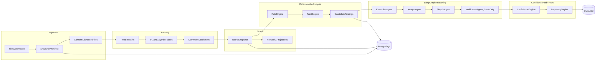

# PART 1 — Trustworthy Static Analysis MVP (Architecture & Implementation Plan)

## Normative inputs and scope freeze

- **Authoritative spec for this plan**: your PART-1 directive (this chat) plus existing project brain: [.cursor/architecture/platform-overview.md](.cursor/architecture/platform-overview.md), [.cursor/architecture/layered-pipeline.md](.cursor/architecture/layered-pipeline.md), [.cursor/memory/conventions.md](.cursor/memory/conventions.md), [.cursor/graphs/](.cursor/graphs/) schema docs, [.cursor/pipelines/](.cursor/pipelines/), [.cursor/agents/](.cursor/agents/).
- **No separate SRS file** exists in-repo today; recommend adding [`docs/srs/part1-static-mvp.md`](docs/srs/part1-static-mvp.md) that copies the locked requirements and version-stamps them (`srs_version`, `freeze_date`) so implementation PRs can trace requirements.
- **PART 1 hard exclusions** (per your constraints): no execution of plugin PHP/JS, no `eval` of repo content, no fuzzing, no browser automation, no dynamic exploit verification. **Verification** in PART 1 means **static verification only** (secondary graph queries, cross-rule consistency, witness minimization, sanitizer-context cross-checks, graph integrity checks). Reserve hooks/interfaces for future dynamic verification without implementing it.

**MVP CLI contract (locked)**

- Command: `hunter scan /path/to/plugin` implemented via **Typer** entrypoint calling the same orchestration library the **FastAPI** service will call later.
- **Output root** (portability): default to `./output/{plugin_slug}/` relative to process CWD; allow override via `HUNTER_OUTPUT_ROOT` (YAML + env). Document that literal `/output/...` is Linux-centric; Windows deployments should set the env var or config key `output.root`.

---

## System context and end-to-end dataflow



**Determinism contract**

- **Deterministic replay token**: `replay_token = hash(plugin_root_abs_path_norm) + content_hash_tree_manifest + parser_lock_hash + grammar_revisions + graph_schema_version + rule_pack_hash + hunter_build_version + agents_disabled_flag + llm_model_id_if_enabled`.
- **Candidate finding IDs** must be derivable without LLMs: e.g. `FINDING|{rule_id}|{anchor_node_id}|{sink_node_id}|{witness_hash}` with canonical serialization.
- **LLMs never emit new candidate vulnerabilities**: LangGraph nodes may only consume `CandidateFinding` + bounded `EvidenceBundle` + `GraphSlice` manifests; outputs are schema-validated; any “new issue” text without new deterministic anchors is rejected at validation layer.

---

## 1) Repository Ingestion Engine

**Purpose**: Produce a tamper-evident, complete enumeration of every file, line, comment-capable span, and filesystem metadata needed for parsing and audit—without trusting paths or symlink tricks.

**Responsibilities**

- Canonicalize plugin root path; detect non-directory inputs early.
- Walk tree with **explicit policies** (max files, max total bytes, max single file bytes, max depth, symlink handling: default “report and skip external symlinks” vs “follow only internal” configurable).
- Compute per-file `sha256`, size, mtime (recorded but not used for determinism), encoding detection (utf-8 default; failures → `ENCODING_AMBIGUOUS` with raw bytes hash).
- Capture **line map** (byte offset → line/col) for every text file accepted for parsing.
- Persist `repository_snapshot/` copy or hardlink strategy: **default** copy into output for reproducibility on same machine; optional `--snapshot-mode=manifest-only` for large disks (still record hashes).

**Internal modules** (package `hunter.ingest`)

- `walk.py` — bounded os.scandir walk, cycle detection for symlink graphs.
- `manifest.py` — deterministic ordering (sorted relative paths utf-8).
- `snapshot_writer.py` — writes `repository_snapshot/files.jsonl`, `tree.sha256`, `ingest_report.json`.
- `errors.py` — typed errors (`PathTraversalAttempt`, `QuotaExceeded`, `UnreadableFile`).

**Interfaces**

- `IngestRequest(root: Path, quotas: QuotaConfig) -> IngestResult`
- `IngestResult` contains `manifest: RepoManifest`, `diagnostics: list[IngestDiagnostic]`, `status: SUCCESS|PARTIAL|FAILED`.

**Inputs / outputs**

- Input: CLI path, YAML quotas.
- Output: `repository_snapshot/` subtree + `RepoManifest` DTO for parsers.

**Graph interactions**: creates `(:Repository)`, `(:Snapshot)`, `(:File)` nodes during graph build (not during ingest if you want strict layering; recommended: ingest outputs manifest only; graph builder creates nodes—keeps ingest pure).

**PostgreSQL interactions**

- Optional in PART 1 if you want “single scan only CLI”: still **recommended** to write `scans` row early (`scan_id`, `root_path_hash`, `started_at`, `status`) for future API; can be feature-flagged `persistence.mode=postgres|sqlite`—**you mandated Postgres**; use it for scan/job/run metadata even if Neo4j holds analysis truth.

**Failure handling**

- Quota exceeded: `PARTIAL` with `stopped_at_path`, preserve manifest up to last successful file record.
- Permission errors: per-file diagnostic, continue.
- Binary detection: classify and skip parsing with explicit reason.

**Logging / observability / audit**

- structlog: `ingest_started`, `ingest_file_ok`, `ingest_file_skipped`, `ingest_completed` with `scan_id`, counts, quota hits.
- Metrics: `ingest_files_total`, `ingest_bytes_total`, `ingest_duration_seconds`, `ingest_errors_total{reason}`.

**Security**

- Zip-slip not applicable to plain directory scan; guard if later zip ingest reuses module.
- Never execute files.

**Reproducibility**

- `files.jsonl` sorted paths + hashes + parser-relevant metadata is the replay basis.

---

## 2) Semantic Parsing Engine

**Purpose**: Parse every eligible text file into a stable IR with byte-exact source mapping, including comments and docblocks as first-class attachments for mismatch analysis later.

**Responsibilities**

- Language classification per file (extension + shebang + PHP/HTML mixed regions policy).
- tree-sitter parse for `php`, `javascript`/`tsx` policy, `html` where configured.
- Emit **CST spans** lifted to internal nodes: declarations, calls, strings (selective), includes, namespaces, classes, methods, closures with captured variables list (best-effort).
- Associate **comments** to nearest covering AST node with rules for leading/trailing comments.
- Record parse diagnostics and **soft failures** per file without aborting scan.

**Internal modules** (package `hunter.parse`)

- `grammar_lock.py` — pins grammar revisions; surfaces `parser_lock_hash`.
- `php_parser.py`, `js_parser.py`, `html_parser.py` — thin wrappers around tree-sitter.
- `lift.py` — CST → `IRNode` graph fragments.
- `line_index.py` — shared byte→line/col service.
- `diagnostics.py` — stable error codes.

**Interfaces**

- `ParseManifest(manifest: RepoManifest) -> ParseRunResult`
- `ParseRunResult.per_file: dict[rel_path, FileParseArtifact]` where artifact includes `ir_bundle`, `diagnostics`, `status`.

**Outputs**

- Write under `cache/parse/{content_hash}/` IR artifacts to dedupe identical files across scans.
- Copy or symlink into `semantic_graph/ir_exports/` for the scan bundle.

**Failure handling**

- Parser crash (native): isolate per file; mark `PARSE_CRASH` with fingerprint; continue scan.
- Malformed PHP: tree-sitter often still returns partial tree; record `ERROR` nodes with error ranges.

**Determinism**

- Stable ordering of IR nodes by `(path, start_byte, end_byte, kind)`.

**Security**

- Parsing runs in-process but CPU/time bounded; no eval.

**Observability**

- Metrics: parse latency histogram by language; error counts by code.

---

## 3) Knowledge Graph System

**Purpose**: Neo4j is the **source of truth** for semantic security structure; NetworkX is an **ephemeral analytical projection** for algorithms that are easier in-memory (e.g., certain fixpoint helpers), always derived from Neo4j exports with explicit `projection_id`.

**Responsibilities**

- Transactional ingestion of IR into labeled property graph matching your graph families from [.cursor/graphs/](.cursor/graphs/).
- Maintain `SchemaMeta` node with `schema_version`, `indexes`, `constraints`.
- Provide **idempotent** MERGE keys for `(Snapshot, path)` file nodes, `(Snapshot, fqn)` symbols where resolvable, else synthetic stable ids for anonymous symbols using `(snapshot_id, file, start_byte, kind)`.

**Internal modules** (package `hunter.graph`)

- `neo4j_client.py` — driver wrapper, parameterized queries only.
- `writers/batch_writer.py` — UNWIND batches with size caps + retry on deadlock.
- `projections/networkx_export.py` — export bounded subgraph for taint engine and agents.
- `integrity.py` — post-load checks (orphans, duplicate keys).

**Graph schema (MVP v1 — consolidates your six families minimally)**

Align with existing docs: [semantic-graph-schema.md](.cursor/graphs/semantic-graph-schema.md), [taint-graph-schema.md](.cursor/graphs/taint-graph-schema.md), [execution-graph-schema.md](.cursor/graphs/execution-graph-schema.md), [trust-boundary-graph-schema.md](.cursor/graphs/trust-boundary-graph-schema.md), [capability-inheritance-graph-schema.md](.cursor/graphs/capability-inheritance-graph-schema.md), [route-reachability-graph-schema.md](.cursor/graphs/route-reachability-graph-schema.md).

**MVP node labels (minimum viable set)**

- `Repository`, `Snapshot`, `File`, `Symbol`, `Callsite`, `StringLiteral` (optional guarded), `Comment`, `HookRegistration`, `FilterRegistration` (can be same label with `kind`), `Route` (REST), `AjaxAction`, `NonceCheck`, `CapabilityCheck`, `Source`, `Sink`, `Sanitizer`, `BasicBlock` (optional phase-1b), `Guard` (optional), `UnknownTarget`.

**MVP relationships**

- `IN_SNAPSHOT`, `DEFINES`, `DECLARED_IN_FILE`, `CALLS|CALLS_UNRESOLVED`, `HOOK_REGISTERS`, `HAS_COMMENT`, `READS_GLOBAL`, `FLOWS_TO` (taint), `TAINTS`, `SANITIZES` (edge to callsite or region), `REQUIRES_CAPABILITY` (route/handler approximations), `HAS_NONCE_CHECK` (approx), `ENTRY_ROUTE` etc.

**Constraints / indexes** (from starters + MVP needs)

- Unique: `(Snapshot.snapshot_id)`; node key `(Snapshot, File.path)`; index `Symbol.fqn` (scoped), `Callsite.id`, `Sink.kind`, `Source.kind`.

**Graph interactions with downstream**

- Rule engine queries only through `hunter.graph.query` templates (no string-built Cypher from LLMs).

**Failure handling**

- Partial batch failure: rollback batch; mark graph build `FAILED` but retain ingest+parse artifacts for replay.

**Security**

- Neo4j credentials from env; least-privilege user; disable HTTP admin in prod patterns (ops doc).

**Reproducibility**

- Export `semantic_graph/cypher_schema_version.txt`, `constraints.cypher`, `snapshot_id.txt`.

---

## 4) Deterministic Security Analysis Engine

**Purpose**: Emit `CandidateFinding` records solely from graph + taint + WP semantic predicates.

**Responsibilities**

- Rule registry loaded from YAML/JSON pack versioned by `rule_pack_hash`.
- Each rule declares: required subgraph shape, required taint witness template, WP context checks, output anchors.
- Deterministic prioritization and deduplication.

**Internal modules** (package `hunter.analysis`)

- `rules/registry.py`, `rules/loader.py` (YAML), `rules/types.py`.
- `engine/runner.py` — executes rules in stable order with per-rule timeouts.
- `witnesses/exporter.py` — serializes minimal subgraph for evidence.

**Interfaces**

- `AnalysisInput(snapshot_id, rule_pack_hash) -> AnalysisOutput`
- `AnalysisOutput.findings: list[CandidateFinding]`, `telemetry: RuleTelemetryRow[]`.

**PostgreSQL**

- Store `findings` table with `finding_id`, `scan_id`, `rule_id`, `severity_band` (initial static), `anchors_json`, `witness_hash`, `created_at`.

**Failure handling**

- Rule timeout: mark `RULE_TIMEOUT` for that rule instance; continue.

**Hallucination prevention**

- No LLM in this package; import guard in CI optional (lint rule).

---

## 5) Multi-Agent Reasoning System (LangGraph)

**Purpose**: Reduce false positives and enrich explainability by **debating** deterministic evidence, never inventing new vulnerabilities.

**Responsibilities**

- Orchestrate: `extract → analyst → skeptic → static_verification_agent → confidence_preliminary → (loop)` with strict budgets.
- Enforce tool allowlist: `fetch_graph_slice(query_template_id, params)`, `fetch_finding(finding_id)`, `append_hypothesis_annotation` (validated), **no** shell, **no** arbitrary cypher from model.

**Internal modules** (package `hunter.agents`)

- `graph_state.py` — typed `AgentState` pydantic models.
- `tools/graph_tools.py` — server-side template binding.
- `workflows/scan_workflow.py` — LangGraph graph definition.
- `validators/llm_output_guard.py` — JSON schema + id presence checks.

**Forbidden actions** (enforced in code + prompts + tool schemas)

- Creating new `CandidateFinding` objects without deterministic engine anchor ids.
- Claiming exact lines not in manifest.
- Running dynamic tests.

**Failure conditions**

- Schema validation failure → retry once with repair prompt template; then mark `AGENT_PARTIAL` and proceed with deterministic-only report section.

**Observability**

- Token usage metrics, tool latency, validation failures.

---

## 6) Confidence Engine

**Purpose**: Produce scores **only** from deterministic features + static verification vector + graph consistency flags + skeptic structured penalties.

**Inputs**

- Feature vector generated in Python (not LLM): examples:
  - `witness_shortest_len`
  - `sanitizer_on_all_paths` (bool or tri-state UNKNOWN)
  - `dynamic_call_unresolved_on_path`
  - `rest_route_permission_literal_present`
  - `ajax_nopriv_true`
  - `capability_check_unknown`
  - `graph_integrity_ok`
  - `skeptic_block_promotion` boolean
  - `static_verifier_refuted` boolean

**Model**

- MVP: **hand-calibrated weighted schema** (versioned YAML) for transparency; optional sklearn logistic in later milestone behind same feature contract.

**Outputs**

- `confidence_score` + `bucket` + `explanations[]` with numeric contributions.

**Never**: raw LLM logprobs.

---

## 7) Reporting Engine

**Purpose**: Emit `/output/{plugin}/reports/` consumable by humans and machines with strict separation of facts vs interpretations.

**Artifacts**

- `reports/findings.json` — schema `FindingReportV1` (includes deterministic anchors, confidence breakdown, skeptic object, static verification summary, reasoning summaries tagged `interpretation: true|false`).
- `reports/summary.md` — executive summary + per-finding sections with code excerpts bounded.
- `evidence/` — per finding folder `evidence/{finding_id}/subgraph.json`, `witness_path.json`, `source_excerpt.txt` with offsets.
- `reasoning/` — structured `trace.jsonl` of agent steps (no chain-of-thought; store decision summaries + tool ids + hashes of tool outputs).

**Remediation guidance**

- Static text templates per `rule_id` + optional parameterized safe mitigation bullets grounded in WP APIs actually present in witness (derived deterministically).

---

## 8) Logging and Auditing System

**Logging**

- `structlog` JSON logs to `logs/scan-{scan_id}.jsonl` **and** stdout.
- Correlation: `scan_id`, `trace_id` (if API), `snapshot_id`.

**Auditing**

- Postgres table `audit_events`: append-only rows for `scan_started`, `graph_write_batch`, `rule_executed`, `agent_tool_called`, `report_emitted`, `operator_override` (future).

---

## 9) Failure Handling Architecture

**Principles**: fail-soft per file; fail-hard only on integrity breaches you cannot safely continue (e.g., Neo4j schema mismatch).

**Matrix (condensed)**

| Failure | Detection | Behavior | User-visible artifact |
|--------|-------------|----------|------------------------|
| malformed PHP | tree-sitter errors | continue; mark file partial | diagnostics in `semantic_graph/parse_diagnostics.jsonl` |
| parser crash | isolated exception | skip file | `PARSE_CRASH` |
| memory pressure | RSS watch / node caps | widen approximations / skip deep files | `LIMITS_APPLIED` |
| neo4j deadlock | retry N | backoff | log |
| graph inconsistency | integrity checks | block promotion of findings | `GRAPH_INTEGRITY_FAILED` section |
| agent schema fail | pydantic | retry then skip agent enrichment | `reasoning/agent_failures.json` |

---

## 10) Project Structure (exact)

```text
src/hunter/
  __init__.py
  settings.py                 # pydantic-settings + YAML merge
  logging.py                  # structlog config
  cli/
    main.py                   # Typer: hunter scan ...
  orchestration/
    scan_runner.py            # single entry orchestrating stages
    stage_status.py
  ingest/
    ...
  parse/
    ...
  graph/
    neo4j/
    writers/
    queries/templates/*.cypher  # vetted templates only
  analysis/
    rules/packs/*.yaml
    taint/
    wp/
  agents/
    workflows/
    tools/
    prompts/                  # versioned prompt templates (text)
  verify_static/              # PART1: static verification only (rename from verify/ to avoid confusion)
  confidence/
  reporting/
  persistence/
    postgres_models.py
    repositories.py
  observability/
    metrics.py
    tracing.py                # OTEL optional feature flag
tests/
fixtures/wp_plugins/minimal_*/...
docs/srs/part1-static-mvp.md   # recommended formal SRS pointer
output/                        # gitignored; user output root default ./output
config/
  default.yaml
```

Naming matches [.cursor/memory/conventions.md](.cursor/memory/conventions.md): snake_case modules, PascalCase models, `RULE-*` ids.

---

## 11) Internal APIs (library contracts)

- `ScanRunner.run(ScanConfig) -> ScanResult` — the single orchestration API used by CLI and future FastAPI.
- `GraphService` — `apply_ir_bundle`, `finalize_snapshot`, `export_slice`.
- `RuleEngine` — `evaluate(snapshot_id) -> list[CandidateFinding]`.
- `TaintEngine` — `run(snapshot_id, profile) -> TaintSummaryIndex` materialized as edges/nodes.
- `AgentWorkflow` — `enrich(findings, snapshot_id) -> EnrichedFindings`.
- `Reporter` — `render(scan_result) -> OutputLayout`.

All cross-boundary payloads are **Pydantic models** versioned (`schema_version` field).

---

## 12) Data Models (strict typed outlines)

**Core**

- `ScanConfig`: paths, quotas, `output_layout`, `neo4j`, `postgres`, `agents_enabled`, `llm` optional block, `threat_profile`.

- `RepoManifestFile`: `rel_path`, `abs_path_norm`, `sha256`, `size`, `language_guess`, `encoding`, `parse_policy`.

- `FileParseArtifact`: `ir_nodes: list[IRNode]`, `edges: list[IREdge]`, `comments: list[CommentNode]`, `diagnostics`.

- `IRNode`: `id`, `kind`, `label`, `file_id`, `start_byte`, `end_byte`, `start_line`, `start_col`, `end_line`, `end_col`, `properties` (typed submodels per kind).

**Graph DTOs** (for exports, not Neo4j internal ids)

- `GraphNodeRef`, `GraphEdgeRef`, `SubgraphBundle` with `nodes[]`, `rels[]` deterministic ordering.

**Findings**

- `CandidateFinding`: `finding_id`, `rule_id`, `severity_band_static`, `title_template_key`, `anchors: list[LocationAnchor]`, `witness: Witness`, `wp_context: WPContextFeatures`, `determinism: DeterminismMeta`.

- `LocationAnchor`: `file_rel_path`, `start_line`, `end_line`, `start_col`, `end_col`, `start_byte`, `end_byte`, `ir_node_id`, `neo4j_node_id?` (optional internal).

- `Witness`: `path_edges: list[EdgeId]`, `summary_hops: list[WitnessHop]`, `taint_labels: set[str]`.

**Reasoning**

- `HypothesisAnnotation` (agent): only references `finding_id` + adds `interpretation`, `risk_notes`, `questions`—cannot add anchors.

- `SkepticVerdict`: `verdict_enum`, `reason_codes[]`, `counter_evidence_refs[]`, `promotion_blocked: bool`.

**Verification (static)**

- `StaticVerificationResult`: `status: CONFIRMED|REFUTED|INCONCLUSIVE`, `checks[]` each with deterministic `check_id` and `details`.

**Confidence**

- `ConfidenceRecord`: `score`, `bucket`, `features: dict[str, float|bool]`, `explanations[]`.

**Audit**

- `AuditEvent`: `event_type`, `timestamp`, `scan_id`, `payload_ref` (hash), `actor`.

Use discriminated unions (`Literal` tags) for stage results as in [.cursor/architecture/layered-pipeline.md](.cursor/architecture/layered-pipeline.md).

---

## 13) Graph Schema (PART 1 operational spec)

**Node types**: as section 3; must include `SchemaMeta`.

**Relationship types**: enforce uppercase rel types; document each in `semantic_graph/relationships.md` generated per scan.

**Traversal patterns** (named templates)

- `TaintWitness_SQLI`, `TaintWitness_XSS`, `Ajax_nopriv_to_sink`, `Rest_public_to_sink`, `Missing_capability_guard`, `Nonce_missing_on_mutator` (only if modeled).

**Reconstructability**

- Every `CandidateFinding` must store enough `EdgeId`/`NodeId` references to rehydrate the witness by replaying template queries against `snapshot_id`.

---

## 14) Taint Tracking System

**Sources (MVP)**

- HTTP superglobals reads modeled as `Source` nodes attached to callsites/expr nodes.
- `$_REQUEST` treated as highest taint width.

**Sinks (MVP)**

- SQL: `$wpdb->query`, unprepared patterns (rule-specific).
- XSS sinks: `echo`/`print` of tainted expr in HTML context classification (initially conservative: any echo of non-literal from tainted var).
- SSRF: `wp_remote_get` family with tainted URL arg (optional rule pack).

**Sanitizers**

- Model `esc_html`, `esc_attr`, `wp_kses`, `prepare` patterns; include **context matrix** file `analysis/taint/context_matrix.yaml`.

**Propagation**

- Intraprocedural first; interprocedural via resolved calls; unresolved calls → `UNKNOWN` widening node with monotonic merge policy (taint must not spuriously clear).

**Graph-based propagation**

- Implement fixpoint in `hunter.analysis.taint` writing `FLOWS_TO` edges into Neo4j (or compute in NetworkX then bulk-write edges—choose based on perf; **tradeoff**: Neo4j-only is simpler ops; NetworkX may be faster for huge taint graphs—recommend **hybrid**: intraproc NetworkX per function then commit summarized edges to Neo4j to keep DB smaller).

**Uncertainty / confidence degradation**

- Any `UNKNOWN` call target on witness path → apply penalty features to confidence; never silently treat as safe.

---

## 15) WordPress Semantic Modeling (MVP explicit)

**Hooks**

- Parse `add_action`, `add_filter` string literal hook names where possible; register `HookRegistration` edges to callbacks (named functions/methods; closures get synthetic symbols).

**AJAX**

- Detect `wp_ajax_*` and `wp_ajax_nopriv_*` registrations; model `AjaxAction` with `nopriv: bool`.

**REST routes**

- Parse `register_rest_route` with literal namespace/route where possible; attach `permission_callback` expression classification: `literal_closure_returns_bool`, `string_function`, `unknown`.

**Capabilities / nonces**

- Extract `current_user_can('cap')` literal caps where possible; mark `unknown` otherwise.
- Nonce checks: detect common patterns (`check_ajax_referer`, `wp_verify_nonce`) as `Guard` nodes tied to handler blocks (approximate).

**Trust boundaries**

- Tag routes/actions with `exposure: PUBLIC_AUTHENTICATED|ADMIN_ONLY|AJAX_NOPRIV|UNKNOWN`.

**Lifecycle**

- Model `plugins_loaded`, `init` registrations only as metadata edges if needed for ordering approximations—MVP can omit execution order simulation beyond “registered”.

---

## 16) Rule Engine

**Pack format (YAML)**

- `id`, `version`, `description`, `severity_band`, `cypher_template_id` OR `python_evaluator_id`, `requires_taint`, `requires_wp_context`, `params`, `tests`.

**Execution**

- Rules run in **stable sorted order** by `id` to aid reproducibility.

**Testing**

- Each rule references fixture plugin snippets in `tests/fixtures/rules/<id>/`.

---

## 17) Agent Communication Architecture

**State machine**: LangGraph with checkpoints stored in Postgres (`langgraph_checkpoints` table) keyed by `scan_id`.

**Message schemas**

- Agent-to-agent messages are pydantic models serialized JSON; include `evidence_manifest_hash`.

**Boundaries**

- Analyst consumes `CandidateFinding` only; outputs `HypothesisAnnotation`.
- Skeptic consumes analyst output + additional slices via tools; outputs `SkepticVerdict`.
- Static verification agent runs deterministic checks list (no LLM) optionally orchestrated separately to keep costs zero—**recommended split**: `verify_static` is code-first; LangGraph node calls it and stores results; optionally a tiny LLM node only formats summaries from those results. **Tradeoff/challenge weak architecture**: mixing LLM into verification invites hallucination—**strong recommendation**: **VerificationAgent is non-LLM** in PART 1; LangGraph only sequences it. LLM nodes are **Analyst+Skeptic+Reporting narrative** only.

This choice maximally satisfies “LLMs never discover vulnerabilities” and “verification is evidence-based”.

---

## 18) Output Persistence

Directory layout under `{output_root}/{plugin_slug}/` (all required):

- `repository_snapshot/` — manifest, optional file copies, `INGEST_META.json`.
- `semantic_graph/` — `snapshot_id.txt`, `schema_version.txt`, exports `nodes.jsonl`/`rels.jsonl` optional snapshot export for airgapped review.
- `findings/` — `candidates.jsonl`, `enriched.jsonl`.
- `evidence/` — per-finding bundles.
- `reasoning/` — agent traces + static verification JSON.
- `reports/` — markdown + json.
- `logs/` — structured logs.
- `cache/` — content-addressed parse caches + graph build caches keyed by hashes.

Also persist the same canonical records in Postgres for query APIs later.

---

## 19) Caching Strategy

- **Parse cache key**: `sha256(content) + grammar_revision + lift_version`.
- **Graph build cache key**: `hash(manifest) + schema_version + lift_version` (if incremental not in MVP, single rebuild each scan is OK—**tradeoff**: simpler correctness).
- **Agent cache** (optional, default off): keyed by `(finding_id, evidence_manifest_hash, prompt_template_version)` to save tokens; must be invalidated on any graph/rule change.

---

## 20) Observability and Metrics

**Tracing**: OpenTelemetry optional; minimum: propagate `scan_id` through structlog `contextvars`.

**Metrics** (Prometheus-friendly naming even if not exported yet)

- ingest/parsing/graph/analysis/taint/agent/report durations
- counts: files, nodes, rels, findings, agent validation failures
- neo4j batch retries

**Hallucination telemetry**

- Count schema validation failures for LLM outputs; alert threshold in future ops.

---

## FastAPI surface (PART 1 scope note)

You mandated FastAPI; MVP can ship CLI-first while exposing a minimal internal API:

- `POST /scans` enqueue scan (optional if timeboxed): returns `scan_id`.
- `GET /scans/{scan_id}` status.

If PART 1 is strictly CLI-only delivery, still implement FastAPI app in `hunter.api` with the same `ScanRunner` to avoid duplicate logic.

---

## Risks, bottlenecks, hallucination risks (explicit)

- **Taint explosion** on large plugins: mitigate via caps, widening, summarization, and feature penalties—not silent truncation without flags.
- **Neo4j write throughput**: batching + indexes; risk supernodes (`CALLS` mega hubs)—mitigate with per-function subgraph commits.
- **Interprocedural resolution limits**: acknowledge false negatives; record `UNKNOWN` explicitly.
- **LLM hallucination in analyst narrative**: mitigated by schema validation + mandatory anchors + skeptic + non-LLM verification.
- **Graph consistency**: integrity checks gate “external publication tier” (even internal reports should show integrity status).
- **Windows path + `/output`**: portability risk—mitigate with config defaults (section 0).

---

## Implementation phasing (recommended PR sequence)

1. **Repo skeleton** + settings YAML + structlog + `ScanRunner` dry-run.
2. **Ingestion** + snapshot outputs + tests.
3. **Parsing** + IR + comment attachment + caches.
4. **Neo4j schema migrations** + writer + integrity checks + exported bundle.
5. **WP semantic extractors** (hooks/ajax/rest) as deterministic graph augmenters post-IR.
6. **Taint engine** + context matrix + persistence to graph.
7. **Rule engine v0** with 3–5 high-signal rules focused on WP (SQLi via `$wpdb->query`, XSS echo, ajax nopriv + missing cap patterns—exact set decided with fixtures).
8. **Static verification suite** (non-LLM) tied to each rule family.
9. **LangGraph** analyst+skeptic with tools + validators; wire static verifier node.
10. **Confidence YAML** + integration.
11. **Reporting** + directory layout + JSON schemas pinned with `schema_version`.
12. **Postgres persistence** + audit events.
13. **FastAPI** minimal endpoints optional parallel.

---

## Engineering tradeoffs (chosen defaults)

| Topic | Choice | Why |
|------|--------|-----|
| VerificationAgent | Non-LLM deterministic checks | eliminates hallucination in verification |
| NetworkX vs Neo4j for taint | Hybrid | performance vs operational simplicity |
| Copy vs manifest-only snapshot | Default copy | reproducibility vs disk; configurable |
| Confidence model | YAML weighted features | interpretability for enterprise buyers |
