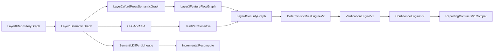

# Part 2 Integration RFC

## Authoritative Inputs Used
- User prompt is treated as the authoritative Part 2 spec source.
- Current implementation baseline:
  - [C:/hunter/src/hunter/orchestration/scan_runner.py](C:/hunter/src/hunter/orchestration/scan_runner.py)
  - [C:/hunter/src/hunter/graph/builder.py](C:/hunter/src/hunter/graph/builder.py)
  - [C:/hunter/src/hunter/analysis/taint/simple.py](C:/hunter/src/hunter/analysis/taint/simple.py)
  - [C:/hunter/src/hunter/wp/augment.py](C:/hunter/src/hunter/wp/augment.py)
  - [C:/hunter/src/hunter/analysis/rules/evaluators.py](C:/hunter/src/hunter/analysis/rules/evaluators.py)
  - [C:/hunter/src/hunter/verify_static/engine.py](C:/hunter/src/hunter/verify_static/engine.py)
  - [C:/hunter/src/hunter/confidence/engine.py](C:/hunter/src/hunter/confidence/engine.py)
  - [C:/hunter/src/hunter/reporting/renderer.py](C:/hunter/src/hunter/reporting/renderer.py)
- Frozen PART 1 contract:
  - [C:/hunter/docs/srs/part1-static-mvp.md](C:/hunter/docs/srs/part1-static-mvp.md)
- Graph and architecture guidance:
  - [C:/hunter/.cursor/graphs/README.md](C:/hunter/.cursor/graphs/README.md)
  - [C:/hunter/.cursor/graphs/semantic-graph-schema.md](C:/hunter/.cursor/graphs/semantic-graph-schema.md)
  - [C:/hunter/.cursor/graphs/taint-graph-schema.md](C:/hunter/.cursor/graphs/taint-graph-schema.md)
  - [C:/hunter/.cursor/architecture/layered-pipeline.md](C:/hunter/.cursor/architecture/layered-pipeline.md)
  - [C:/hunter/.cursor/memory/graph-philosophy.md](C:/hunter/.cursor/memory/graph-philosophy.md)

## Current-State Audit (Evidence-Based)
- **Exists (strong):**
  - Deterministic ingest/parse/graph/analysis/enrichment/report pipeline orchestrated centrally.
  - Minimal IR model and parser lift for PHP/JS/HTML with parser-lock hash and parse cache.
  - In-memory graph snapshot export and integrity checks.
  - WordPress semantic extraction (hooks/ajax/rest/capability/nonce) via deterministic heuristics.
  - Coarse taint sources/sinks and FLOWS_TO witness generation.
  - YAML rule pack with deterministic runner and stable finding id format.
  - Static verification statuses (`CONFIRMED`/`REFUTED`/`INCONCLUSIVE`).
  - Confidence engine with feature-only weighted scoring.
  - Output contracts (`reports/findings.json`, `summary.md`, evidence bundles, reasoning trace).
  - Optional Postgres persistence and optional Neo4j schema meta write.
- **Partial (present but insufficient for Part 2):**
  - IR has nodes but no expression-level dataflow graph, no call-arg mapping, no symbol table persistence.
  - Neo4j integration exists only for `SchemaMeta`; no canonical graph write/read path yet.
  - LangGraph orchestration exists but deterministic templates only (no advanced tool-mediated reasoning).
  - Verification is structural-only, no alternate semantic proving tiers.
  - Confidence features are narrow and not tied to CFG/path-feasibility or sanitizer constraints.
  - Telemetry exists but not stage-complete (no parser/graph/taint/rule histograms by semantic dimensions).
- **Missing (required by Part 2):**
  - Interprocedural semantic resolution and call graph.
  - CFG, SSA, PHI, symbolic constraints, feasible-path taint.
  - Layer 0-4 explicit graph architecture with sync/integrity policies.
  - Dynamic dispatch/reflection/magic-method modeling.
  - Object injection/POP/gadget-chain analysis.
  - Semantic diffing, patch lineage, variant analysis, incremental recomputation.
  - Scalable 100k+ LOC performance controls for graph+taint explosion.

## Non-Negotiables (Must Remain Untouched)
- Keep existing CLI behavior and command surface in [C:/hunter/src/hunter/cli/main.py](C:/hunter/src/hunter/cli/main.py).
- Preserve output directory topology and report/finding schema keys in [C:/hunter/src/hunter/reporting/renderer.py](C:/hunter/src/hunter/reporting/renderer.py).
- Preserve deterministic replay inputs and finding-id stability conventions in [C:/hunter/src/hunter/orchestration/scan_runner.py](C:/hunter/src/hunter/orchestration/scan_runner.py) and [C:/hunter/docs/srs/part1-static-mvp.md](C:/hunter/docs/srs/part1-static-mvp.md).
- Preserve verification status taxonomy and confidence record shape in [C:/hunter/src/hunter/models/findings.py](C:/hunter/src/hunter/models/findings.py).
- Preserve strict separation: deterministic discovery first, agent reasoning second.

## Target Part 2 Architecture

## Layered Graph Evolution Strategy
- **Layer 0 Repository Graph (new explicit layer):** files, manifests, hashes, include/import edges, snapshot lineage.
- **Layer 1 Semantic Graph:** symbols, callsites, resolved/unresolved calls, object shapes, reflection markers.
- **Layer 2 WordPress Semantic Graph:** hooks/action/filter lifecycle, ajax/rest exposure, capability/nonce semantics, multisite boundary attributes.
- **Layer 3 Feature Flow Graph:** CFG blocks, SSA vars, PHI merges, branch constraints, taint-state transitions.
- **Layer 4 Security Graph:** findings evidence motifs, exploitability constraints, gadget capability scores, verification outcomes.
- **Indexes/constraints:** introduce migration-managed constraints for `Snapshot`, `File(path scoped)`, `Symbol(fqn scoped)`, `Callsite(id scoped)`, `TaintRegion(id scoped)`, `SecurityMotif(id scoped)`.
- **Synchronization:** graph writes are transactional by layer with lineage pointers; no cross-layer orphan edges.
- **Integrity validation:** extend [C:/hunter/src/hunter/graph/integrity.py](C:/hunter/src/hunter/graph/integrity.py) to layer-aware checks, referential completeness, duplicate identity detection.

## Subsystem Design and Integration
- **IR v2 subsystem**
  - Purpose: deterministic semantic IR for cross-file reasoning.
  - Responsibilities: typed symbols, references, call arguments, assignment/use chains, include/require resolution.
  - Integration: extends [C:/hunter/src/hunter/models/ir.py](C:/hunter/src/hunter/models/ir.py), consumed by graph builder and CFG builder.
  - Failure: unresolved constructs become explicit `Unknown*` nodes.
  - Determinism: canonical sort by file, span, symbol kind; stable scoped ids.
- **Cross-file resolver subsystem**
  - Purpose: resolve function/method/callable-array dispatch across files.
  - Responsibilities: namespace-aware lookup, class/method map, hook callback linking, dynamic dispatch widening.
  - Integration: new stage between parse and graph build in [C:/hunter/src/hunter/orchestration/scan_runner.py](C:/hunter/src/hunter/orchestration/scan_runner.py).
  - Failure: unresolved paths emit uncertainty edges and confidence penalties.
- **CFG/SSA subsystem**
  - Purpose: path-feasibility backbone.
  - Responsibilities: build per-function CFG, convert to SSA, emit PHI nodes, attach guard constraints.
  - Integration: Layer 3 graph writer + taint engine inputs.
  - Performance: per-function budgets, loop widening, block caps.
- **Path-sensitive interprocedural taint subsystem**
  - Purpose: replace same-file ordering with constraint-aware propagation.
  - Responsibilities: source/sink typing, sanitizer context matrix, call-summary propagation, recursion handling.
  - Integration: supersedes [C:/hunter/src/hunter/analysis/taint/simple.py](C:/hunter/src/hunter/analysis/taint/simple.py) behind feature flag.
  - Failure: partial path outputs preserved with explicit limits metadata.
- **WordPress semantics v2 subsystem**
  - Purpose: lifecycle-aware WP execution semantics.
  - Responsibilities: action/filter registration+mutation, REST permission callback semantics, nonce/capability inheritance, cron/option persistence surfaces, upload/filesystem trust boundaries.
  - Integration: evolves [C:/hunter/src/hunter/wp/augment.py](C:/hunter/src/hunter/wp/augment.py) to graph-backed semantic extraction instead of regex-only file scan.
- **Security advanced analysis subsystem**
  - Purpose: object injection, POP chains, gadget discovery, workflow-aware exploitability motifs.
  - Responsibilities: unserialize sources, magic method entrypoints, gadget capability scoring, reachable-sink confirmation.
  - Integration: new rule evaluators and graph traversals in `analysis/security` package.
- **Variant/Patch intelligence subsystem**
  - Purpose: semantic diff and regression lineage.
  - Responsibilities: snapshot diff across commits, incomplete-fix detection, variant clustering.
  - Integration: new diff pipeline reading Layer1-4 snapshots + persistence lineage tables.
- **Verification v2 subsystem**
  - Purpose: stronger static corroboration without dynamic exploit dependence.
  - Responsibilities: alternate traversal proof, path-feasibility checks, contradiction detection.
  - Integration: extend [C:/hunter/src/hunter/verify_static/engine.py](C:/hunter/src/hunter/verify_static/engine.py) while preserving status taxonomy.
- **Confidence v2 subsystem**
  - Purpose: calibrated confidence over richer deterministic evidence.
  - Responsibilities: add CFG/SSA/path/sanitizer/uncertainty features and preserve explainability vectors.
  - Integration: evolve [C:/hunter/src/hunter/confidence/engine.py](C:/hunter/src/hunter/confidence/engine.py), maintain output schema compatibility.

## Rule Engine Evolution Strategy
- Keep rule-pack contract and deterministic ordering from [C:/hunter/src/hunter/analysis/rules/loader.py](C:/hunter/src/hunter/analysis/rules/loader.py).
- Add evaluator families for interprocedural motifs, gadget motifs, and workflow motifs.
- Require each rule to declare: required layers, minimum witness requirements, uncertainty downgrade policy.
- Preserve `finding_id` composition; extend witness payloads rather than changing top-level keys.

## Neo4j and Schema Evolution Plan
- Introduce schema version `2` with migration scripts and compatibility views.
- Keep `SchemaMeta` writes but add full snapshot metadata nodes and layer versioning.
- Add migration policy: v1 report consumers continue reading V1-compatible output while graph internal schema upgrades.
- Add graph write mode flag (`in_memory_v1`, `neo4j_v2_dualwrite`, `neo4j_v2_only`) for staged rollout.

## Backward Compatibility and Migration Strategy
- **Dual-run period:** run v1 and v2 analyzers in parallel on fixtures; compare finding identity, status, and determinism deltas.
- **Output compatibility:** continue emitting `FindingReportV1` with extended optional fields (`semantic_trace`, `constraint_summary`, `layer_path_refs`).
- **CLI compatibility:** preserve `hunter scan PATH` semantics and existing options.
- **Telemetry compatibility:** keep existing counters and add suffix `_v2` metrics to avoid dashboard breaks.

## Feature-Flag Rollout Strategy
- Retain existing flags in [C:/hunter/src/hunter/settings.py](C:/hunter/src/hunter/settings.py).
- Add staged flags:
  - `semantic_ir_v2_enabled`
  - `resolver_interprocedural_enabled`
  - `cfg_ssa_enabled`
  - `taint_path_sensitive_enabled`
  - `wp_semantics_v2_enabled`
  - `security_popchain_enabled`
  - `semantic_diff_enabled`
  - `incremental_recompute_enabled`
  - `neo4j_layered_write_enabled`
- Enforce safe defaults `False`; progressive enablement by test tier.

## Telemetry and Observability Plan
- Structured logs per stage transition with `scan_id`, `snapshot_id`, `layer`, `rule_id`, `limit_flags`.
- Metrics additions:
  - parser: node counts, unresolved symbol rate.
  - graph: write batch latency, orphan-edge rate, layer cardinality.
  - taint: states explored, path-pruning counts, sanitizer-context mismatches.
  - rules: traversal latency by rule family.
  - confidence: bucket drift and feature sparsity.
  - verification: contradiction and inconclusive reasons.
- Tracing: span boundaries around parse/layer-build/rule/verify/confidence/report.

## Failure Handling Plan
- Never fail silently; emit structured limits and uncertainty markers.
- Survive malformed PHP, unresolved symbols, ambiguous dispatch, failed partial graph writes via per-stage degradations.
- Distinguish infra failure vs analysis inconclusive in outputs and persistence.
- Preserve partial outputs with explicit `analysis_limits` section per finding.

## Testing Strategy
- Unit tests:
  - resolver, CFG, SSA, PHI merge, sanitizer context logic, gadget scorer.
- Integration tests:
  - end-to-end scan with v2 flags, graph migration tests, deterministic replay tests.
- Security fixtures:
  - WordPress vulnerable corpus, nonce/capability edge cases, object injection fixtures.
- Regression tests:
  - lock expected findings and evidence paths; prevent silent contract drift.
- Performance tests:
  - 100k+ LOC plugin corpus, graph build throughput, taint expansion budget tests.

## Performance and Caching Plan
- Incremental parse + semantic recompute by changed files and dependent symbols.
- Function-summary caching for interprocedural taint.
- Graph batch write optimization and bounded memory projections.
- Deterministic pruning and widening policies for path explosion.

## Risks and Mitigations
- **Graph explosion risk:** enforce layer-wise cardinality budgets, summarize low-value nodes.
- **Taint explosion risk:** widening, summary caching, path cutoffs with explicit penalties.
- **Determinism risk:** canonical ordering, stable ids, replay token extension governance.
- **Hallucination risk:** agents restricted to deterministic artifacts; no vulnerability creation in agent path.
- **Compatibility risk:** dual-run and contract tests before enabling v2 defaults.

## Rollout Plan
- Phase A: schema + IR/resolver foundations (no output changes).
- Phase B: CFG/SSA + taint v2 under flags; dual-write graph snapshots.
- Phase C: WP semantics v2 + advanced security motifs + verification v2.
- Phase D: semantic diff/incremental recompute + performance hardening.
- Phase E: default-on promotion after determinism, perf, and regression gates pass.

## Refactor Boundaries
- Extend existing modules; do not replace stable contracts wholesale.
- Keep orchestration entrypoint and reporting contracts as integration anchor.
- Avoid competing abstractions by introducing v2 packages behind interfaces and feature flags, then converging once stable.